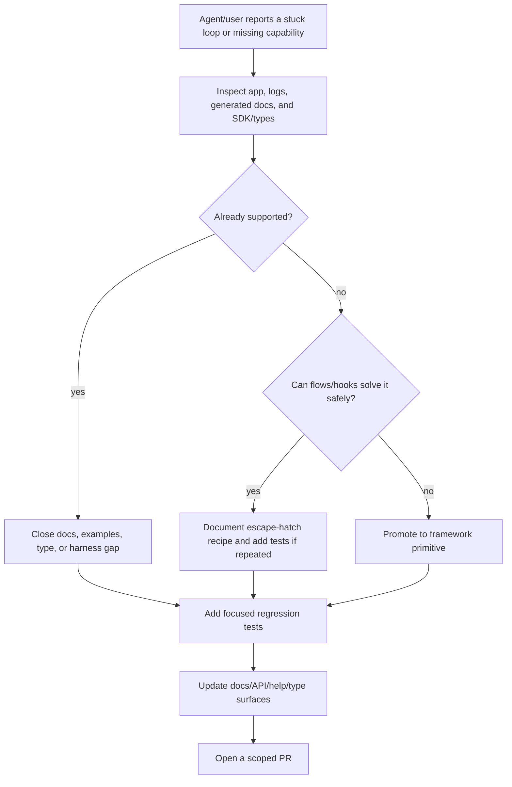

# Contributing to Benmore

Thanks for your interest in the Benmore framework.

## Build & test

No Docker, no make, no frontend build step.

```bash
go build -tags sqlite_fts5 -o benmore .   # build
go vet -tags sqlite_fts5 ./...            # static analysis (must pass)
go test -tags sqlite_fts5 ./...           # tests
./benmore serve ./example --port 8080     # run an app locally
```

The `sqlite_fts5` tag is required (the SQLite driver uses cgo, so you also need
a C toolchain).

## Guidelines

- Keep the framework **app-agnostic**: no hardcoded domains, emails, or
  branding. Configuration comes from `app.yaml` / `env.yaml` / CLI flags.
- All SQL is parameterized - never concatenate user input into queries.
- `go vet ./...` must pass before you open a PR.
- Match the style of the surrounding code.
- If an app-building agent gets stuck in a loop, stop and inspect the loop
  before adding code. The framework may already support the behavior and the
  missing piece may be documentation, generated types, or a harness check.
- When closing a gap, decide whether it belongs as a framework primitive or as
  an escape-hatch recipe (see the [Gap Tiers](#gap-tiers) table for the full
  decision matrix).
- Every new primitive must update the docs surfaces that agents read:
  `docs/agent/build.md`, the generated SDK/type surface where relevant
  (`bm` SDK helpers and the YAML config types in `types.go`), and the runtime
  docs endpoint that exposes the feature (`GET /api/_docs` / `GET /docs`, served
  from `apidocs.go`).

## Production-Readiness Loop

Use this loop when hardening Benmore for real apps. The diagram committed below is
the single source of truth for the loop; any copy in a PR description is for
convenience only.



### Gap Tiers

| Tier | Meaning | Expected action |
| --- | --- | --- |
| Documentation/harness gap | The framework already supports it, but agents cannot find or verify it | Improve docs, generated types, CLI/help text, or tests |
| Framework primitive gap | A repeated app need should be configurable without custom flows/hooks | Add a small primitive and document it |
| Genuine functionality gap | The behavior cannot be implemented safely even with flows/hooks | Add runtime support with tests before documenting it as available |

### PR Tags

This is a new, opt-in convention for identifying the surface a PR touches. It is
being introduced here; existing PRs that use the `[codex]` prefix (or no tag) are
exempt and do not need to be retagged. New PRs should prefix the title with one of
the bracketed tags below (a bracketed `[CLI]` style is used so the tags are safe in
shells and commit history):

| Tag | Surface | Examples |
| --- | --- | --- |
| `[OSS]` | Open-source framework runtime and SDK | `bm` SDK, OpenAPI, app runtime, generated types |
| `[CLI]` | Tooling that ships with the hosted/internal CLI workflow | release gates, deploy/push/pull contracts, command output rules |
| `[Platform]` | Hosted Benmore platform and deployment layer | docs site, systemd hardening, security scans, router behavior |

## Reporting issues

- Bugs and feature requests: open a GitHub issue.
- Security vulnerabilities: **do not** open a public issue - see
  [SECURITY.md](SECURITY.md).
