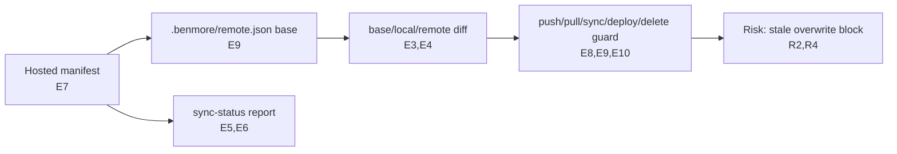
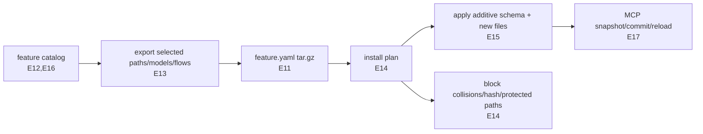

# QA Plan - Feature Packs And Sync Safety

## Header / Metadata

- Plan ID: `QA-2026-07-09-feature-packs-sync-safety`
- Date: 2026-07-09
- Trigger: local/remote sync safety plus reusable feature-pack cloning for Benmore apps
- Branch: `agent-feature-packs-sync-safety`
- Risk level: HIGH
- Platform: Benmore Go monorepo, cloud/platform CLI and platform host surfaces
- Changed file count: 20+ code/docs/test files
- Project context source: VERIFIED from repository instructions and changed source files

## Root Cause / Change Summary

This change protects a local Benmore app workspace from overwriting newer deployed source by adding a hosted source manifest, a local `.benmore/remote.json` base, and guards on mutating CLI commands. It also adds a reusable `feature.yaml` pack format so app fragments or curated starters such as `notify-hub`, `kanban`, and `foundry` can be listed, exported, dry-run installed, and applied through CLI/MCP.

Change inventory:

| Area | Summary |
| --- | --- |
| Manifest / sync | New deployable-source manifest excludes data, secrets, runtime state, logs, generated SDK types, and classifies local/remote/base drift. |
| CLI commands | New `sync-status` and `feature` commands; existing push, pull, sync, deploy, and delete-file use manifest guards and `--force`. |
| Platform / MCP | New `/platform/app-manifest` endpoint plus `feature_catalog`, `feature_export`, and `feature_install` MCP tools. |
| Pack format | Versioned `feature.yaml` includes files, hashes, schema model source, routes/static assets, env references by name, and install requirements. |
| Safety behavior | Remote installs dry-run by default; apply blocks file/model collisions, protected paths, missing manifest entries, and hash mismatches. |
| Docs | `api(at:)`, agent docs, CLI skill, and changelog now describe the clone/pack workflow. |

## Evidence Ledger

| Evidence ID | Source | Verified Fact | Used For | Confidence |
| --- | --- | --- | --- | --- |
| E1 | `source_manifest.go:18` | Source manifests fingerprint deployable code and intentionally exclude secrets, data, uploads, git/runtime state, logs, and generated `bm.d.ts`. | R1, R3, R6 | high |
| E2 | `source_manifest.go:134` | Manifest exclusion code filters `.git`, `.benmore`, `uploads`, `logs`, `data.db*`, `env.yaml`, `*.log`, and `src/bm.d.ts`. | R1, T1, T12 | high |
| E3 | `source_manifest.go:245` | `DiffSourceManifests` compares base/local/remote and emits drift/conflict counts. | R2, R4, T2-T5 | high |
| E4 | `source_manifest.go:303` | Diff classification covers no-base conflict, local/remote changes, both-changed conflicts, and local/remote deletes. | R2, T2-T5 | high |
| E5 | `cli_sync_status.go:25` | `benmore sync-status` parses dir, app, env, and JSON flags, then exits 0 clean, 1 drift, 2 conflict, 3 setup error. | R2, T6-T8 | high |
| E6 | `cli_sync_status.go:100` | CLI fetches the deployed app manifest from `/platform/app-manifest` using platform credentials. | R2, R5, T7 | high |
| E7 | `platform.go:665` | This branch's platform source registers `GET /platform/app-manifest`, authenticates the user, resolves env/app instance, and returns manifest JSON with env key names; the currently deployed hosted platform still lacks it. | R1, R5, T9 | high |
| E8 | `cli_thin_clients.go:337` | `pushOneFile` calls the manifest guard before write_file and refreshes the remote manifest after success. | R2, R4, T10 | high |
| E9 | `cli_pull_hybrid.go:103` | Pull fetches remote manifest, checks pull safety before extraction, then writes `.benmore/remote.json`. | R2, R4, T11 | high |
| E10 | `cli_deploy.go:119` | Existing-app deploys run the bulk manifest guard before pushing files; newly-created app deploys skip the bulk preflight. | R2, R4, T10 | high |
| E11 | `feature_pack.go:21` | Feature packs are versioned `feature.yaml` manifests with files, schema models, flows/hooks/routes/static assets, env refs, and required options. | R6, R7, T13 | high |
| E12 | `feature_pack.go:81` | Catalog includes curated `kanban`, `notify-hub`, `foundry`, approvals, CRM pipeline, and audit feed entries. | R7, T14 | high |
| E13 | `feature_pack.go:100` | Feature export accepts selected paths/models/flows and defaults to manifest-selected files when no explicit selection is given. | R6, R7, T13 | high |
| E14 | `feature_pack.go:438` | Install planning blocks protected paths, missing manifest entries, hash mismatch, file collisions, model collisions, unsafe delete-missing combinations, and required options. | R6, R8, T15-T18 | high |
| E15 | `feature_pack.go:569` | Applying a pack appends additive schema models and writes files only after a non-blocked plan. | R6, R8, T19 | high |
| E16 | `feature_pack.go:1152` | Curated packs build the same manifest/file map as exported app packs, including `notify-hub` and `foundry`. | R7, T14 | high |
| E17 | `mcp_tools_feature.go:147` | `feature_install` is dry-run by default, applies only when requested, snapshots git first, rolls back tracked files on apply failure, commits, and reloads. | R8, R9, T20-T22 | high |
| E18 | `cli_feature.go:229` | CLI exposes `feature clone` and top-level `clone`, parses positional target apps, env/source-env/target-env, selected paths/models/flows, route/model prefixes/maps, and replace/delete-missing flags. | R7, T23, T25, T26, T28 | high |
| E19 | `mcp_tools_api.go:1010` | `api(at:"sync-status")` documents commands, exit codes, statuses, guard behavior, and exclusions. | R10, T24 | high |
| E20 | `mcp_tools_api.go:1028` | `api(at:"feature-packs")` documents feature commands, MCP tools, catalog, safety, and gotchas. | R10, T24 | high |
| E21 | `source_manifest_test.go:28` | Unit test covers clean, local changed, remote changed, conflict, local/remote deletes, local-only, and remote-only statuses. | T2-T5 | high |
| E22 | `source_manifest_test.go:61` | Unit test proves protected paths are excluded from manifests. | T1, T12 | high |
| E23 | `feature_pack_test.go:20` | Unit test proves export selects requested files/models and excludes protected paths. | T13 | high |
| E24 | `feature_pack_test.go:50` | Unit test proves install planning blocks file and schema model collisions. | T15-T16 | high |
| E25 | `feature_pack_test.go:82` | Unit test proves install planning blocks hash mismatch. | T17 | high |
| E26 | `feature_pack_test.go:102` | Unit test proves curated foundry pack is available. | T14 | high |
| E27 | `source_manifest.go:365` | Pull-safe pruning removes only files classified as `deleted_remote` and rejects paths that escape the manifest root. | R2, R4, RT4 | high |
| E28 | `source_manifest_test.go:101` | Unit tests prove safe remote deletions are pruned while local-only/conflict files remain, and escaping paths fail. | RT4 | high |
| E29 | `cli_feature.go:338` | Clone resolves curated packs/pack files first, otherwise exports from a local source dir or pulled remote source app before installing. | R7, T23, T25 | high |
| E30 | `feature_pack.go:69` | Install plans now report file adds, updates, deletes, replace, delete_missing intent, route/model prefixes/maps, and file/route/model renames. | R6, R7, R8, T25, T26, T28 | high |
| E31 | `feature_pack.go:438` | Install planning supports explicit replace, blocks unsafe delete_missing combinations, detects missing archive entries, and plans delete-missing against the target manifest only for whole-source packs. | R6, R8, T18, T25, T26, T28 | high |
| E32 | `mcp_tools_feature.go:73` | MCP `feature_install` accepts replace/delete_missing plus route_prefix/model_prefix and exact route/model maps, then applies them through the same plan/apply path. | R8, T20-T22, T25, T26, T28 | high |
| E33 | `feature_pack_test.go:54` | Tests cover flow selection and missing selected-path errors. | T13, T25 | high |
| E34 | `feature_pack_test.go:106` | Tests cover missing archive entries, protected paths, additive apply, replace updates, delete-missing deletes, tar round-trip, unsafe tar paths, and all curated core packs. | T14-T19, T25 | high |
| E35 | `cli_feature_test.go:11` | Cloud-tagged tests cover clone argument parsing, positional targets, source/target env split, selected local source export, curated pack bytes, curated-selection rejection, and fake MCP `feature_install` payloads. | T23, T25 | high |
| E36 | `cli_feature_test.go:129` | Fake-MCP test proves `runFeatureInstall` sends app/env, dry_run/apply, replace, delete_missing, and decodable pack bytes to `feature_install`. | T23, T25 | high |
| E37 | `feature_pack_test.go:230` | Unit test proves route_prefix/model_prefix rewrite static paths, Prisma model names, and inferred table-name/API references while avoiding existing collisions. | T26 | high |
| E38 | `feature_pack_test.go:288` | Unit test proves route_prefix renames flow files and rewrites custom API route strings. | T26 | high |
| E39 | `feature_pack_test.go:463` | Unit test proves curated Kanban, Notify Hub, and Foundry packs include routes, flows, richer models, clean local apply, loadable flows, and compilable static pages. | T14 | high |
| E40 | `feature_pack.go:30` | Pack limits cap decoded archive size, uncompressed source bytes, per-entry size, feature.yaml size, and archive entry count. | T27 | high |
| E41 | `feature_pack_test.go:600` | Unit test proves oversized file bodies, too-many-file packs, and oversized tar entries are rejected. | T27 | high |
| E42 | `mcp_tools_feature_test.go:13` | Platform-tagged MCP test proves oversized `pack_b64` is rejected before app lookup. | T27 | high |
| E43 | `cli_feature.go:305` | CLI parser accepts repeatable `--route-map FROM=TO` and `--model-map Old=New` and blocks maps with `--delete-missing`. | T28 | high |
| E44 | `feature_pack.go:630` | Exact route/model maps are normalized and validated before install transforms run. | T28 | high |
| E45 | `feature_pack.go:996` | Explicit route maps move matching static route files and single-route flow files before planning/apply. | T28 | high |
| E46 | `feature_pack_test.go:337` | Unit test proves exact route/model maps avoid collisions and rewrite static files, flow files, route strings, Prisma models, and table-name tokens. | T28 | high |
| E47 | `mcp_tools_feature_test.go:28` | Platform-tagged MCP test proves map arguments parse from JSON objects and string shorthand. | T28 | high |
| E48 | `feature_pack.go:567` | Apply has a test-only after-write hook, nil in production, used to force deterministic partial-write failure. | R8, T22 | high |
| E49 | `mcp_tools_feature_test.go:48` | Platform-tagged rollback test snapshots a git-backed temp app, forces failure after overwriting a tracked file, restores with `gitHardRestore`, and verifies old content returns. | R8, T22 | high |
| E50 | `cli_mcp.go:131` | CLI formats missing `feature_*` MCP tools with a feature-pack platform-update hint for mixed-version client/server windows. | R7, R9, T23 | high |
| E51 | `cli_mcp_test.go:10` | Cloud/platform-tagged tests cover the missing feature-tool hint and unrelated unknown-tool passthrough. | R7, R9, T23 | high |
| E52 | Hosted command output, 2026-07-09 | `/tmp/benmore-cloud clone notify-hub clone-proof-8-rf92ss --target-env dev --dry-run` reached the platform but returned `unknown tool: feature_install`; patched CLI added the deploy/update guidance. | R7, R8, R9, T23 | high |
| E53 | `mcp_tools_api.go:1060` | Canonical `api(at:"feature-packs")` says installed TSX files are feature modules and do not rewrite existing nav automatically. | R7, R10, T24 | high |
| E54 | `docs/agent/build.md:427` | Agent build docs tell app builders to import/link installed TSX modules or add a host HTML page for clean navigation. | R7, R10, T24 | high |
| E55 | `skills/benmore-cli/SKILL.md:298` | CLI skill carries the app-shell integration note for agents using `benmore clone`. | R7, R10, T24 | high |
| E56 | `CHANGELOG.md:43` | Release notes disclose the app-shell linking expectation for installed TSX feature modules. | R7, R10, T24 | high |
| E57 | `cli_sync_status.go:126` | CLI formats missing `/platform/app-manifest` with a sync-status/source-manifest platform-update hint. | R2, R4, R9, T6, T7 | high |
| E58 | `cli_sync_status_test.go:53` | Cloud/platform-tagged tests cover the missing app-manifest hint and unrelated HTTP status passthrough. | R2, R4, R9, T6, T7 | high |
| E59 | Hosted command output, 2026-07-09 | `/tmp/benmore-cloud sync-status /tmp/benmore-sync-proof --app clone-proof-8-rf92ss --env dev --json` reached the platform but returned HTTP 404; patched CLI returned a JSON setup error with deploy/update guidance. | R2, R4, R9, T6, T7 | high |
| E60 | `tar_resilience_test.go:15` | Cloud/platform-tagged test proves `createTarGz` includes normal source but excludes `data.db*`, `env.yaml`, `.git`, `.benmore`, `uploads`, `logs`, `src/bm.d.ts`, and `*.log`. | R1, T12 | high |
| E61 | `feature_pack.go:469` | Planner blocks `delete_missing` unless the pack is a whole-source snapshot containing `app.yaml` and `schema.prisma`; schema-model-only curated packs cannot prune target source. | R6, R8, T25, T29 | high |
| E62 | `feature_pack_test.go:248` | Curated Notify Hub with `--replace --delete-missing` blocks and plans no target file deletes. | R6, R8, T29 | high |
| E63 | `cli_feature.go:399` | CLI returns nonzero when a `feature_install` MCP JSON response contains `ok:false`. | R9, T30 | high |
| E64 | `cli_feature_test.go:249` | Cloud-tagged test proves blocked `feature_install` responses return nonzero from the CLI helper. | R9, T30 | high |
| E65 | `cli_deploy.go:160` | Deploy file collection uses `sourceManifestExcluded`, aligning deploy upload scope with manifest safety exclusions. | R1, R4, T31 | high |
| E66 | `cli_deploy.go:175` | Newly-created deploy pushes use `force || created`, preventing bare-scaffold self-conflicts while ordinary deploys keep guard behavior. | R2, R4, T32 | high |
| E67 | `cli_deploy_test.go:11` | Deploy tests prove source-manifest-excluded paths are not collected and newly-created deploy force behavior is explicit. | R1, R4, T31, T32 | high |
| E68 | `cli_sync.go:77` | Interactive `benmore sync` exits nonzero on list or pull failures. | R4, R9, T33 | high |
| E69 | `cli_sync_test.go:11` | Sync tests prove failed pulls are counted while all apps are attempted, and list failure returns failure count. | R4, R9, T33 | high |
| E70 | `cli_pull_hybrid.go:250` | Pull tar extraction uses a safe join rejecting absolute paths and parent path segments, and rejects link entries. | R1, R4, T34 | high |
| E71 | `tar_resilience_test.go:91` | Pull extraction tests cover absolute paths, parent segments, symlink/hardlink entries, and benign dotted filenames. | R1, R4, T34 | high |

## Global Context Map

| Subsystem | Entrypoints | Data / State | External Boundaries | Auth / Tenant Boundary | Tests | Evidence | Confidence |
| --- | --- | --- | --- | --- | --- | --- | --- |
| Hosted manifest | `GET /platform/app-manifest` | app source files, env key names, git head | platform HTTP API | `authenticatePlatformRequest`, app instance resolution | manifest unit tests, platform build | E1, E2, E7, E22 | high |
| Workspace sync | `sync-status`, `pull`, `sync`, `push`, `delete-file`, `deploy` | local files, `.benmore/remote.json`, deployed manifest | platform API and MCP write/delete tools | platform credentials; app/env target | manifest diff tests and CLI build | E3-E10, E21, E57-E59 | high |
| Feature packs | `benmore feature ...`, `benmore clone`, `feature_*` MCP tools | tar.gz with `feature.yaml` and `files/`, schema additions, replace/delete-missing plans | local FS, remote source pulls, remote MCP install | platform app access check | feature pack unit tests plus cloud/platform-tagged CLI/MCP tests | E11-E18, E23-E26, E29-E52 | high |
| Docs / propagation | `api(at:)`, `docs/agent/build.md`, `skills/benmore-cli/SKILL.md`, changelog | user/agent-facing workflow text | app-builder agents and CLI users | none | doc review, build compile unaffected | E19, E20, E53-E56 | high |

## Scope & Out Of Scope

In scope:

- Verify manifest exclusions and drift classifications.
- Verify sync-status exit code semantics and JSON reporting shape.
- Verify guards block stale destructive writes by default and allow explicit `--force`.
- Verify pack export/install safety, curated catalog behavior, and dry-run defaults.
- Verify docs describe notify-hub/foundry cloning and selected-component export.

Out of scope:

- A full UI/browser screenshot pass. This change has no user-facing browser UI.
- A live platform deployment against production credentials.
- Arbitrary direct file-map implementation beyond route/model maps.
- Copying seed data, uploads, env values, or secrets. That is intentionally excluded.

## Blast Radius

| Area ID | Hop | Area | Evidence | Why It Matters | Confidence |
| --- | --- | --- | --- | --- | --- |
| A1 | 0 | Manifest builder/exclusions | E1, E2 | Prevents leaking secrets/data into manifests and packs. | high |
| A2 | 0 | Diff classification | E3, E4 | Incorrect classification could block safe work or allow stale overwrite. | high |
| A3 | 1 | `sync-status` command | E5, E6 | Agents and hooks use exit codes to decide whether to push. | high |
| A4 | 1 | Push/delete/deploy/pull/sync guards | E8-E10 | A bad guard can overwrite Titov's remote edits or block normal workflows. | high |
| A5 | 0 | Feature pack format/export/install | E11, E13-E15, E30, E31 | Incorrect pack contents or install planning can corrupt target apps. | high |
| A6 | 1 | Curated catalog | E12, E16 | User-visible clone workflow depends on `notify-hub` and `foundry` availability. | high |
| A7 | 1 | MCP feature install | E17, E32 | Remote installs mutate hosted app source and must remain conservative. | high |
| A8 | 2 | Agent docs and `api(at:)` propagation | E19, E20 | App-building agents will follow these instructions when cloning components. | high |

## Mermaid And ASCII Graphs



```text
SYNC FLOW
[GET /platform/app-manifest E7]
  -> [.benmore/remote.json after pull E9]
  -> [DiffSourceManifests E3/E4]
  -> [sync-status exit codes E5]
  -> [guarded push/pull/deploy/delete E8/E9/E10]
```



```text
FEATURE PACK FLOW
[curated or app source E12/E13/E16]
  -> [feature.yaml + files/ E11]
  -> [dry-run plan E14]
      -> blocks collisions/hash/protected paths E14
      -> apply writes additive models/files E15
          -> snapshot/commit/reload on platform E17
```

## Risk Assessment

| Risk ID | Area | Likelihood | Impact | Score | Coverage | Evidence | Confidence | Rationale |
| --- | --- | ---: | ---: | ---: | --- | --- | --- | --- |
| R1 | Secret/data leakage through manifest or pack tarball | 3 | 5 | 15 | Heavy | E1, E2, E11, E22, E23 | high | The feature serializes file lists and pack archives; protected paths must never leak. |
| R2 | Sync diff misclassifies conflict as safe drift | 4 | 5 | 20 | Exhaustive | E3-E5, E21 | high | This is the primary safety promise: prevent overwriting remote edits. |
| R3 | No-base workspace behavior is too permissive | 3 | 4 | 12 | Heavy | E4, E5 | high | Fresh or manually copied workspaces lack `.benmore/remote.json`; shared changed files must be treated conservatively. |
| R4 | Guard integration misses a mutating command | 3 | 5 | 15 | Heavy | E8-E10 | high | Push/delete/deploy/pull/sync are the high-impact paths. |
| R5 | Env targeting resolves wrong dev/prod instance | 3 | 4 | 12 | Heavy | E6, E7, E10 | high | The manifest must match the selected deployed environment, not a different app instance. |
| R6 | Feature pack install writes unsafe files or destructive schema | 3 | 5 | 15 | Heavy | E11, E14, E15, E30, E31 | high | Pack install mutates app source and schema; default must stay additive/collision-blocking and replace/delete must be explicit. |
| R7 | User cannot clone notify-hub/foundry, whole apps, or selected components | 2 | 4 | 8 | Standard | E12, E13, E16, E18, E29 | high | Core product request is reusable app/component/app cloning. |
| R8 | Remote install partial failure leaves app corrupted | 3 | 5 | 15 | Heavy | E14, E15, E17, E31, E32, E48, E49 | high | Platform apply path must plan first, snapshot, and rollback tracked files on failure. |
| R9 | MCP/CLI output hides blocked install details | 2 | 3 | 6 | Standard | E17, E18 | high | Agents need plan details to resolve collisions manually. |
| R10 | Docs drift from implementation | 2 | 3 | 6 | Standard | E19, E20 | high | `api(at:)` is canonical propagation for app builders. |

## Test Cases By Feature Area

| # | Test Case | Priority | Type | Risk | Evidence | Steps | Expected | Caveats |
| --- | --- | --- | --- | --- | --- | --- | --- | --- |
| T1 | Manifest excludes protected local files | P0 | security | R1 | E1, E2, E22 | Create app dir with `env.yaml`, `data.db`, `uploads/`, `.benmore/`, `src/bm.d.ts`, and normal source files; build manifest. | Manifest contains source files only; protected paths absent. | Covered by unit test; add platform endpoint smoke before release. |
| T2 | Clean/base/local/remote files classify as synced | P0 | functional | R2 | E3, E4, E21 | Diff identical base/local/remote manifests. | File status is `synced`; no drift/conflict. | Unit covered. |
| T3 | One-sided local and remote edits classify correctly | P0 | functional | R2 | E3, E4, E21 | Diff base with local-only SHA change and remote-only SHA change. | Statuses are `local_changed` and `remote_changed`; drift true. | Unit covered. |
| T4 | Both local and remote changed classify as conflict | P0 | functional | R2 | E3, E4, E21 | Diff base where both local and remote SHA differ and do not match each other. | Status is `conflict`; exit policy should block mutating commands. | Unit covered; CLI integration remains needed. |
| T5 | Local/remote delete states classify correctly | P0 | functional | R2 | E4, E21 | Diff base with local missing / remote present and local present / remote missing. | Statuses are `deleted_local` and `deleted_remote`. | Unit covered. |
| T6 | `sync-status --json` returns machine-readable report | P0 | functional | R2, R9 | E5, E6, E57-E59 | Against a test platform app, run `benmore sync-status <dir> --app X --env dev --json`. | JSON includes counts, files, app/env, remote git head, and git secondary info when available. | Hosted attempt reached platform but is deploy-blocked because current platform lacks `/platform/app-manifest`; mixed-version setup error guidance is now covered. |
| T7 | `sync-status` exit codes match clean/drift/conflict/auth error | P0 | functional | R2, R3 | E5 | Drive clean, non-conflicting drift, conflict, and unauthenticated cases. | Exits 0, 1, 2, and 3 respectively. | CLI subprocess test should be added if harness supports mocked platform responses. |
| T8 | No-base shared file differences are conflict | P0 | edge | R3 | E4 | Remove `.benmore/remote.json`, keep local app file different from remote manifest. | Shared file difference reports conflict rather than silent local/remote preference. | Unit partially covered for diff; full CLI behavior needs mock platform. |
| T9 | Platform manifest endpoint enforces auth/app/env | P0 | security | R1, R5 | E7 | Request without token, missing app, inaccessible app, dev/prod env. | Unauthorized/missing/inaccessible fail; valid env returns manifest with env key names only. | Requires platform HTTP test or integration environment. |
| T10 | Push/deploy block stale conflicting overwrite by default | P0 | regression | R2, R4, R5 | E8, E10 | Simulate remote changed since base and local content changed; run push/deploy without `--force`. | Command exits conflict code and does not call write_file for conflicting file. | Needs CLI guard unit or MCP call mock. |
| T11 | Pull/sync do not overwrite conflicting local files without force | P0 | regression | R2, R4 | E9 | Create local modified file, stale base, remote changed file; run pull/sync. | Pull blocks before tar extraction; `--force` extracts and refreshes base. | Needs integration test around tar extraction. |
| T12 | Pull tarball and manifest exclude data/secrets/logs/generated SDK | P0 | security | R1 | E1, E2, E9, E22, E60 | Pull/export app containing protected paths. | Tarball and manifest omit protected files. | Direct `createTarGz` regression coverage added; hosted pull endpoint smoke still recommended after platform rollout. |
| T13 | Export selected files/models/flows only | P1 | functional | R6, R7 | E11, E13, E23, E33 | Run `feature export` with `--paths static/foo.tsx --models Notification --flows send`. | Pack contains selected files, extracted model source, flow metadata, hashes, no protected paths; missing explicit selections fail. | Unit covered. |
| T14 | Curated `notify-hub`, `kanban`, and `foundry` export through same format | P1 | functional | R7 | E12, E16, E26, E34, E39 | Run `feature list`; export each curated slug. | Catalog lists all; exports produce `feature.yaml`, static pages, flow files, route metadata, and richer model entries. | Unit covered for all three core curated packs, including local apply, flow loading, and TS compile. |
| T15 | Install dry-run blocks existing file collision | P0 | functional | R6 | E14, E24 | Target has `static/notify.tsx`; pack includes same path. | Plan is blocked with file collision; no write occurs. | Unit covered. |
| T16 | Install dry-run blocks existing model collision | P0 | migration | R6 | E14, E24 | Target schema already has model from pack. | Plan is blocked with model collision. | Unit covered. |
| T17 | Install dry-run blocks tampered pack file hash | P0 | security | R6 | E14, E25 | Mutate tar file body after manifest hash. | Plan is blocked with `sha256 mismatch`. | Unit covered. |
| T18 | Install blocks missing feature.yaml file entries and protected paths | P0 | security | R1, R6 | E14, E31, E34 | Construct pack with files absent from archive or protected path names. | Plan blocked; no file write. | Unit covered. |
| T19 | Apply writes additive schema and new files after clean plan | P1 | functional | R6 | E14, E15, E34 | Apply a pack to empty target app dir with schema. | New files are written and model source appended; existing files unchanged. | Unit covered. |
| T20 | MCP remote install dry-run is default | P0 | functional | R8, R9 | E17 | Call `feature_install` without `dry_run:false`. | Returns plan; does not mutate app dir. | Needs MCP integration test. |
| T21 | MCP apply snapshots git and commits after success | P1 | observability | R8 | E17 | Apply clean pack to git-backed app dir. | Creates preflight snapshot, writes pack, commits `feature_install:<slug>`, reloads app. | Needs platform integration or fake git dir. |
| T22 | MCP apply rollback restores tracked files on failure | P0 | regression | R8 | E17, E48, E49 | Force apply failure after snapshot. | Tracked file returns to snapshot content through `gitHardRestore`. | Platform-tagged failure-injection coverage exists for tracked files; live hosted MCP response and untracked cleanup remain unproven. |
| T23 | CLI clone/install of curated notify-hub/foundry dry-runs against target app | P1 | functional | R7, R9 | E12, E18, E29, E35, E36, E50-E52 | Run `benmore clone notify-hub --app target --env dev --dry-run`; repeat `benmore feature clone foundry --app target --env dev --dry-run`. | Pretty JSON plan reports schema/file additions or collisions. | Hosted notify-hub dry-run was attempted with real auth and disposable target but blocked because deployed platform lacks `feature_install`; mixed-version error guidance is now covered. |
| T24 | `api(at:)` and CLI skill docs expose clone workflows | P1 | regression | R10 | E19, E20 | Read `api(at:"feature-packs")` and `api(at:"sync-status")`; inspect docs/skill. | Commands, safety, catalog, and gotchas match code. | Manual/doc review sufficient. |
| T25 | Whole-app clone-over dry-run plans updates/deletes only with explicit replace/delete_missing | P0 | functional | R6, R7, R8 | E18, E29-E36, E61 | Run clone/feature_install with a pack containing root source files, one existing file, one new file, and one target-only file. | Without replace collisions block; with replace update/add plan is allowed; with delete_missing stale target source is listed for delete and apply removes it only for whole-source packs. | Core planner/apply, cloud CLI args, and fake MCP payload are covered; live hosted validation still recommended. |
| T26 | Prefix install avoids common route/model collisions | P1 | functional | R6, R7 | E18, E30-E32, E37, E38 | Install a pack whose static route, flow route, table reference, and model name already exist in the target using `--route-prefix ops --model-prefix Ops`. | Dry-run reports file/route/model renames; apply writes transformed file/schema/flow content; delete_missing with prefixes blocks. | Unit covered; live hosted validation still recommended. |
| T27 | Oversized feature packs are rejected before remote install work | P0 | security | R1, R6, R8 | E40-E42 | Create oversized file bodies, too-many-file packs, oversized tar entries, and oversized MCP `pack_b64`. | Local tar write/read paths reject the pack; platform MCP rejects oversized base64 before app lookup/extract. | Unit covered; hosted gateway request-size behavior still needs live proof. |
| T28 | Exact route/model maps avoid mature-app collisions | P1 | functional | R6, R7 | E18, E30-E32, E43-E47 | Install a pack with `/notify-hub` and `Notification` into a target that already has those names using `--route-map /notify-hub=/alerts --model-map Notification=AlertNotification`. | Dry-run/apply reports exact file/route/model renames, rewrites static and single-route flow files, rewrites route strings/table tokens, and blocks invalid maps. | Unit covered; live hosted validation still recommended. |
| T29 | Curated/component packs cannot prune target apps with delete_missing | P0 | regression | R6, R8 | E31, E61, E62 | Plan Notify Hub with `--replace --delete-missing` against a target with `app.yaml`, `schema.prisma`, and unrelated files. | Plan blocks and reports no `file_deletes`. | Unit covered; hosted dry-run remains blocked by deployed platform version. |
| T30 | Feature install/clone returns nonzero when MCP plan is blocked | P1 | regression | R9 | E63, E64 | Mock `feature_install` returning `{"ok":false}` and call the CLI helper. | CLI helper returns nonzero while still printing JSON. | Unit covered. |
| T31 | Deploy upload scope matches manifest exclusions | P0 | security | R1, R4 | E1, E2, E65, E67 | Collect deploy files in a workspace containing `.codex`, logs, screenshots, uploads, data DB, env, and generated SDK files. | Only deployable source files are collected. | Unit covered; hosted deploy smoke still recommended after rollout. |
| T32 | First deploy of newly-created app cannot self-conflict with bare scaffold | P1 | regression | R2, R4 | E10, E66, E67 | Exercise deploy force decision for created vs existing apps. | Created app pushes force through bare scaffold; existing app deploys keep guard behavior unless `--force`. | Unit covered at helper level; full CLI remote smoke still recommended. |
| T33 | Interactive sync exits nonzero on list or pull failures | P1 | regression | R4, R9 | E68, E69 | Mock app listing and one failed pull; separately mock list failure. | Sync reports one failure and attempts remaining apps; interactive entrypoint can exit nonzero. | Unit covered for accounting; subprocess exit smoke not added. |
| T34 | Pull tar extraction rejects traversal and links while allowing dotted filenames | P0 | security | R1, R4 | E70, E71 | Extract tarballs with absolute paths, parent segments, symlink/hardlink entries, and `foo..bar` paths. | Unsafe/link entries error loudly; benign dotted filenames extract. | Unit covered; extraction remains streaming/non-atomic. |

## Regression Test Cases

| # | Test Case | Priority | Type | Risk | Evidence | Steps | Expected | Caveats |
| --- | --- | --- | --- | --- | --- | --- | --- | --- |
| RT1 | Existing deploy first-run behavior remains unblocked | P1 | regression | R4 | E10 | Deploy a brand-new app directory. | First deploy skips remote manifest guard because no deployed remote exists yet. | Covered by build only; needs CLI integration. |
| RT2 | `--force` bypasses guard and refreshes base after success | P1 | regression | R2, R4 | E8, E9 | Run push and pull with conflict plus `--force`. | Command proceeds and `.benmore/remote.json` updates after success. | Needs mocked platform/integration test. |
| RT3 | Cloud edition does not link platform fleet internals | P1 | compatibility | R4, R10 | AGENTS edition seam, build tags, cloud-leak guard | Build cloud edition and run leak guard. | Build succeeds; leak guard passes. | Covered by validation commands. |
| RT4 | Pull prunes remote-deleted files only when local still matches base | P1 | regression | R2, R4 | E27, E28 | Pull with a file classified `deleted_remote`, plus local-only and conflict files. | Deleted-remote file is removed; local-only/conflict files remain. | Unit covered for prune helper; live pull integration still recommended. |

## Edge Cases & Negative Tests

- Missing or incompatible `feature.yaml` must fail before install planning.
- Pack paths with `../` or absolute path attempts must fail safe through `safeFeatureJoin`.
- Remote manifest mismatch for app/env/subdomain should invalidate stale base instead of trusting the wrong `.benmore/remote.json`.
- `sync-status` should still surface GitHub ahead/behind only as secondary context; deployed manifest remains authoritative.
- Env refs in packs must remain names only; never serialize values.

## Conditional Checks

Security:

- Protected paths stay excluded from manifests, pull tarballs, and feature tarballs.
- Platform manifest endpoint requires authenticated app access.
- Pack hash mismatch blocks install.

Migration/data:

- Schema install is additive only.
- Existing model collisions block.
- No data copy, upload copy, seed copy, or destructive migration path is introduced.

Compatibility:

- Cloud and platform builds must compile.
- `scripts/cloud-leak-guard.sh` must pass because CLI code touches platform-facing concepts.

## Adversarial Review Notes

Findings challenged and applied:

- Missing tamper protection on pack file bodies would let an archive drift from `feature.yaml`; install planning now blocks SHA-256 mismatch (E14, E25).
- Diff status coverage needed deletes and no-base cases; unit tests cover local/remote deletes and no-base shared-file conflict (E21).
- Curated foundry was requested alongside notify-hub; catalog and test now include foundry (E12, E16, E26).
- Docs needed to answer "clone notify-hub or pick components"; canonical `api(at:)`, agent docs, CLI skill, and changelog include catalog and selected-path/model/flow export instructions (E19, E20).
- Pull could refresh `.benmore/remote.json` while leaving a safely remote-deleted local file behind; pull now prunes only `deleted_remote` files and unit tests cover local-only/conflict preservation (E27, E28).
- `benmore clone` was still an install alias, not a source-app clone path. It now exports from local/remote source apps and selected components before install, with explicit whole-app clone-over flags (E18, E29-E34).
- Feature install accepted unbounded pack archives before app lookup; local tar paths and MCP now enforce archive, uncompressed, entry, manifest, and file-count limits (E40-E42).
- Mature target app collisions needed more than broad prefixes; exact route/model maps now cover specific route/model rewrites through CLI, MCP, plan/apply, and tests (E43-E47).
- MCP rollback needed direct failure-injection coverage; platform-tagged tests now force failure after a tracked file write and prove `gitHardRestore` restores snapshot content (E48, E49).
- Hosted clone dry-run reached the platform and exposed a mixed-version failure (`feature_install` missing); CLI now gives a deploy/update hint instead of only the raw JSON-RPC error (E50-E52).
- Hosted sync-status reached the platform and exposed a mixed-version failure (`/platform/app-manifest` missing); CLI JSON setup-error output now gives a deploy/update hint (E57-E59).
- App-shell integration for installed TSX modules needed explicit guidance; canonical API docs, agent docs, CLI skill, and changelog now describe import/link or host-HTML wiring (E53-E56).
- Pull tarball exclusion needed direct coverage; `createTarGz` now has a protected-path regression test aligned with manifest exclusions (E60).
- A second adversarial pass found `delete_missing` was still unsafe for curated/component packs; planner now requires whole-source roots and blocks curated Notify Hub pruning (E61-E62).
- `feature install`/`clone` could hide blocked plans behind exit 0; CLI helper now returns nonzero for `ok:false` (E63-E64).
- Deploy could ship source-manifest-excluded files and first deploy could self-conflict; deploy now shares manifest exclusions and forces only newly-created app pushes (E65-E67).
- Interactive sync could report failures but exit success; failure counts now propagate to `CLISync` (E68-E69).
- Pull tar extraction used an ad hoc traversal check; it now rejects unsafe paths/links and allows benign dotted names (E70-E71).

Unresolved concerns:

- Route/model prefix and exact-map support covers common and targeted collisions; arbitrary direct file maps are still not implemented.
- Pack static files are installed and app-shell linking is now documented, but hosted route behavior still needs proof after platform rollout.
- Rollback restores tracked git files and is now failure-injection covered; untracked files written before an unexpected failure can still require cleanup unless failure happens before writes or the app has a clean git snapshot.
- Hosted clone/apply proof is blocked until the deployed platform includes the new `feature_*` MCP tools from this PR.
- Hosted sync/conflict proof is blocked until the deployed platform includes `/platform/app-manifest` from this PR.
- Hosted gateway request-size and error presentation for oversized pack uploads still needs proof against a disposable deployed app.
- Live platform integration tests were not added in this patch because current tests are in-process Go unit tests plus build gates.
- Pull extraction is not atomic; if a later archive entry is unsafe after earlier safe files, those earlier files can remain on disk before the error returns.

## Fix Queue

| Fix ID | Finding | Evidence | Risk ID | Risk | Recommended Action | Mutates Code? | Approval Needed |
| --- | --- | --- | --- | --- | --- | --- | --- |
| F1 | Arbitrary direct file mapping is not implemented. | E43-E47, T28 | R6, R7 | LOW | Add `--file-map FROM=TO` only if hosted/mature app validation shows route/model maps are insufficient for real installs. | yes | no, if scheduled in this feature line |
| F2 | Pull tarball exclusion shares intent with manifest and now has direct `createTarGz` regression coverage; hosted pull smoke remains unproven. | E2, E9, E60, T12 | R1 | LOW | After platform rollout, run one hosted pull/export smoke containing protected paths if a disposable app can safely exercise it. | no | needs platform rollout |
| F3 | Untracked generated-file cleanup is not proven for future install failure paths. | E17, E48, E49, T22 | R8 | MEDIUM | Extend rollback proof to untracked generated files if install apply ever writes generated files before a failure. | yes | no |
| F4 | Hosted route exposure for installed static modules remains unproven even though manual app-shell linking is documented. | E53-E56, T23, T24 | R7 | LOW | After platform rollout, probe the installed static/flow surfaces and add a tiny app-shell example only if hosted validation shows users still need one. | docs | no |
| F5 | Hosted gateway behavior for oversized pack uploads is not proven. | E40-E42, T27 | R1, R8 | MEDIUM | Run a disposable hosted `feature_install` with an oversized archive and record the exact user-facing error. | no | needs hosted credentials/test app |
| F6 | Deployed platform has not picked up the feature-pack MCP tools yet. | E50-E52, T23 | R7, R8, R9 | HIGH | Deploy/update the platform with this PR, then rerun hosted dry-run/apply/probe validation on disposable apps. | deploy | needs platform rollout |
| F7 | Deployed platform has not picked up the app-manifest endpoint yet. | E57-E59, T6, T7 | R2, R4, R9 | HIGH | Deploy/update the platform with this PR, then rerun hosted `sync-status` and stale-local conflict smoke on disposable workspaces. | deploy | needs platform rollout |
| F8 | Pull extraction is safer but not atomic. | E70-E71, T34 | R1, R4 | LOW | Consider temp-dir extraction plus rename if platform pull tarballs are not fully trusted or if partial writes on malicious archives are unacceptable. | yes | no |

## Smoke Test Checklist

1. Build cloud edition: `go build -tags 'sqlite_fts5 cloud' -o /tmp/benmore-cloud .`.
2. Build platform edition: `go build -tags 'sqlite_fts5 platform' -o /tmp/benmore-platform .`.
3. Run unit suite: `go test -tags sqlite_fts5 ./...`.
4. Run vet: `go vet ./...`.
5. Run cloud leak guard: `bash scripts/cloud-leak-guard.sh`.
6. Run `git diff --check`.
7. Run local unit focus for manifest diff statuses.
8. Run local unit focus for feature pack export/install planning.
9. Manually inspect `api(at:"feature-packs")` for notify-hub/foundry/component-picking instructions.
10. Confirm `tmp/` and other unrelated untracked files are not staged.

## Analysis Caveats

- The plan is based on current local source and local validation. It does not prove behavior against a live benmore.ai deployment.
- CLI integration tests with a mocked platform HTTP server are still recommended for exit-code and guard-path proof.
- No Playwright screenshots are applicable because this patch does not change a visible browser UI.
- GitHub CLI and hosted Benmore auth are available; the live-proof blocker is the deployed platform version missing `feature_install` and `/platform/app-manifest`.

## Exit Criteria

Ship only when:

- `go test -tags sqlite_fts5 ./...` passes.
- `go vet ./...` passes.
- `go build -tags 'sqlite_fts5 cloud' -o /tmp/benmore-cloud .` passes.
- `go build -tags 'sqlite_fts5 platform' -o /tmp/benmore-platform .` passes.
- `bash scripts/cloud-leak-guard.sh` passes.
- `git diff --check` passes.
- The commit excludes unrelated `tmp/` files.
- Draft PR includes validation output and adversarial review notes.
