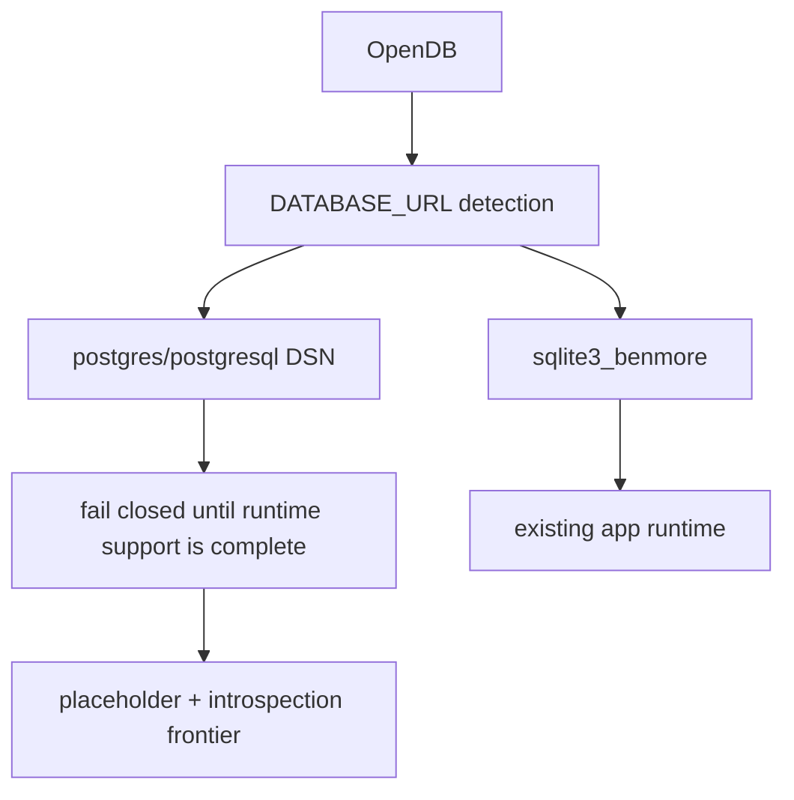

# Database Frontier

SQLite remains Benmore's production app database backend. Postgres/pgx support
starts with a dialect boundary and must fail closed until migrations, generated
DDL, encryption SQL functions, FTS, backups, and insert-returning semantics are
ported deliberately.

The first slice recognizes Postgres DSNs in both the URL form
(`postgres://` / `postgresql://`) and the libpq keyword form
(`host=... dbname=... user=...`), centralizes local SQLite DSN tuning, and adds
an experimental placeholder-rewriting helper for later `$1`/`$2` Postgres
queries. The helper is unit-tested but not yet wired into any runtime CRUD path.
It does not enable app runtime Postgres yet, and the Postgres `DBOpenConfig`
deliberately leaves `DriverName` empty until a pgx driver is actually
registered.

