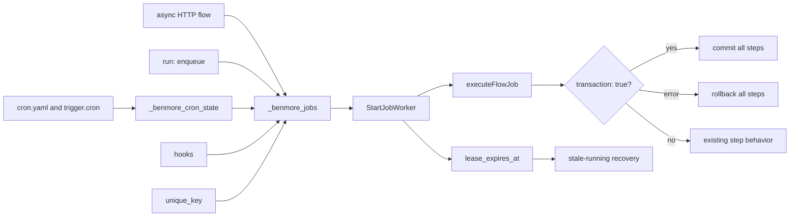
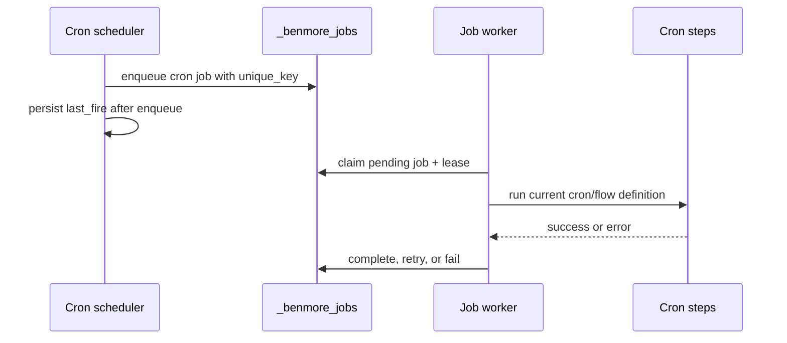

# Durable Jobs Frontier

Benmore has a lightweight durable queue in `_benmore_jobs`: delayed run times,
attempts, retries, worker claiming, leases, idempotency keys, cron execution,
and a status endpoint. These River-like slices keep the embedded queue simple
while making production retries and crash recovery predictable.



This does not import River. It keeps the existing embedded queue and makes the
transaction boundary, worker leases, uniqueness, and cron durability reliable
before adding larger queue primitives.

## Leases

When a worker claims a job it stamps `lease_expires_at` (now + lease window)
and a random `lease_owner` token. If the process crashes before marking the job
completed/failed, the next worker pass recovers expired `running` jobs.

Recovery is **fail-closed** to avoid duplicate side effects (C-1): a crashed
job's body ran *outside* the claim transaction, so we cannot know whether its
email / webhook / SQL side effects already fired before the crash. Re-running
blindly would risk delivering them twice.

- Job types on the `jobRerunSafeTypes` allowlist (proven idempotent; **empty by
  default**) -> back to `pending`, with the same exponential backoff as a normal
  failure (`1<<attempts * 30s`) so a job that reliably kills its worker does not
  hot-loop on immediate re-pickup.
- Every other orphaned `running` job -> `failed`, with an explanatory error, and
  is **never re-run** (re-running a non-idempotent job risks a duplicate
  email/webhook/mutation). An operator can inspect the failed row and re-trigger
  deliberately if it is safe.

Either way the job is reclaimed out of `running`, so it never sticks there
forever after a crash. A type graduates onto `jobRerunSafeTypes` only once its
handler is guarded by a per-job completion marker that makes a second run a
no-op.

### Lease renewal (the load-bearing invariant)

The lease window is **not** a maximum job runtime. While a worker is alive and
running a job it heartbeats the lease forward every lease-window/3
(`startLeaseHeartbeat` / `jobLeaseHeartbeatFor`), scoped to its `lease_owner`
token. A job may therefore
legitimately run far longer than one lease window without ever becoming
reclaimable.

The invariant the whole scheme rests on is: **an expired lease means the owning
worker is gone, not merely that the job is slow.** This is what makes recovery
safe under the queue's transient multi-worker overlap (across a SIGHUP reload):
a sweep can only reclaim a lease whose owner stopped heartbeating, so a
slow-but-alive worker's in-flight job is never reset to `pending` and
double-executed. Terminal writes (complete/fail/retry) are likewise guarded by
`lease_owner = ?`, so a worker whose lease lapsed and was reclaimed cannot stomp
the new owner's run.

The heartbeat interval must stay comfortably below the lease window so a brief
stall (GC pause, slow DB write) does not let the lease lapse while the worker is
still alive.

### Tuning

The lease window defaults to 5 minutes (`jobLeaseDuration`) and is overridable
per deployment via the `BENMORE_JOB_LEASE_SECONDS` env var (`jobLeaseDurationFor`).
It is the main knob for crash-recovery latency: shorter recovers faster but
heartbeats more often; longer is gentler on the DB but delays recovery of a
genuinely dead worker's jobs.

### Migration of pre-lease `running` jobs

Recovery only touches rows with a non-NULL `lease_expires_at`, so jobs left
`running` by pre-lease code would otherwise be stuck forever. `EnsureJobsTable`
runs a one-time best-effort backfill that stamps such rows with a lease anchored
at their `started_at`, letting the normal sweep recover them after the upgrade.

## Known limitation: side-effect idempotency

The `transaction: true` boundary only covers SQL executed through `flowDB`
(the active `*sql.Tx`). External side effects performed by other step
types — email, webhook, notify — are NOT transactional: a rollback cannot
undo them. When a transactional job fails *after* such a step, the whole
flow is rolled back and the job is later retried from the top, so the DB
writes are correctly reverted but the external side effects re-fire on the
retry. Until idempotency/unique keys land (see future work below), author
transactional flows so that side-effect steps are either idempotent or
ordered after the steps that can fail.

Future work: leases, uniqueness/idempotency keys, stale-running recovery,
cron-to-jobs conversion, and side-effect idempotency.

## Unique Keys

`unique_key` is an optional idempotency key for active work. If a `pending` or
`running` job already has the same key, enqueue returns that existing job id and
status token instead of inserting another row. Once the earlier job completes or
fails, the same key can enqueue fresh work again.

**First active enqueue wins.** When an active job already holds the key, the
later enqueue is a no-op against the in-flight job: its `run_at` and `payload`
are *ignored* and not reconciled. A re-enqueue with an earlier `run_at` (e.g.
"run now" after an earlier "run in 1h") does **not** reschedule the in-flight
job - the original schedule stands. If you need a different schedule or payload,
wait for the in-flight job to finish (which releases the key) before
re-enqueuing.

**Transactional enqueue (`EnqueueJobTx`/`EnqueueJobTxUnique`).** Inside a
`*sql.Tx`, go-sqlite3 reads from the transaction's snapshot, so a row committed
by a *competing* transaction after the snapshot is invisible to the in-Tx dedup
SELECT. If two transactions race the same key, the loser's INSERT trips the
partial UNIQUE index; rather than failing the whole flow transaction, the loser
treats the collision as a successful idempotent no-op (returns id `0` / empty
token because the winner's id is unreadable from the stale snapshot). Tx callers
that need the winning job's id or status token should re-read by `unique_key`
after the transaction commits.

Flow enqueue steps can set it with:

```yaml
- id: report
  enqueue:
    flow: generate_report
    unique_key: "report:${{ user_id }}:${{ params.month }}"
```

## Cron Jobs

Cron no longer launches best-effort goroutines. Each due schedule enqueues a
`job_type = 'cron'` row with a stable per-minute `unique_key`, then the normal
job worker executes it. That gives scheduled work the same lease recovery,
retry, status, and idempotency behavior as async flows.

### Retry semantics: at-most-once by default

Routing cron through the worker means a cron step CAN be retried. To avoid a
silent behavior change for non-idempotent schedules (carrier syncs, outbound
email, billing), each cron defaults to `max_attempts: 1` - **at-most-once**, the
same as the pre-durable-queue goroutine that ran a fire exactly once and never
retried it. A cron opts into **at-least-once** retries explicitly:

```yaml
idempotent_sync:
  schedule: "every 15m"
  max_attempts: 3        # opt in: failing steps retry with backoff
  flow: sync_all
```

Caveat for retried crons: `runCronJob` aborts on the first failing step, so a
retry re-runs steps 1..N from the top. Only set `max_attempts > 1` when the
whole step list is safe to re-run.

### Same-minute duplicate-fire guard

The cron `unique_key` is minute-specific (`cron:<id>:<minute>`). Unlike a
flow's `unique_key` (which can be reused once its job leaves pending/running),
the cron key is deduped against rows in **any** status - including `completed`.
That closes the window where a restart inside the same minute, after the first
job already finished and `last_fire` was lost, would otherwise re-enqueue and
fire the schedule a second time. `last_fire` (hydrated from
`_benmore_cron_state` at startup) is the primary guard; a hydration failure is
logged loudly and the any-status `unique_key` dedup is the backstop.

### Missing definitions

A cron row can outlive its definition (the schedule was edited/removed after the
row was enqueued). The worker treats "cron definition not found" as a terminal
no-op: it logs and completes the job rather than retrying and producing a
spurious `failed` row for work that no longer exists.


