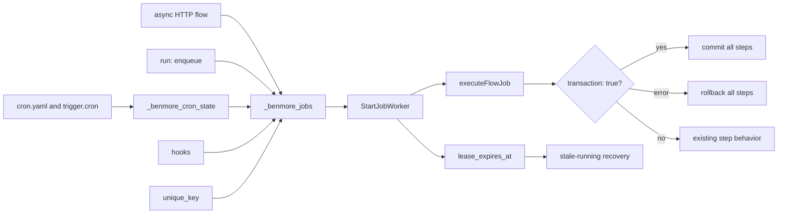
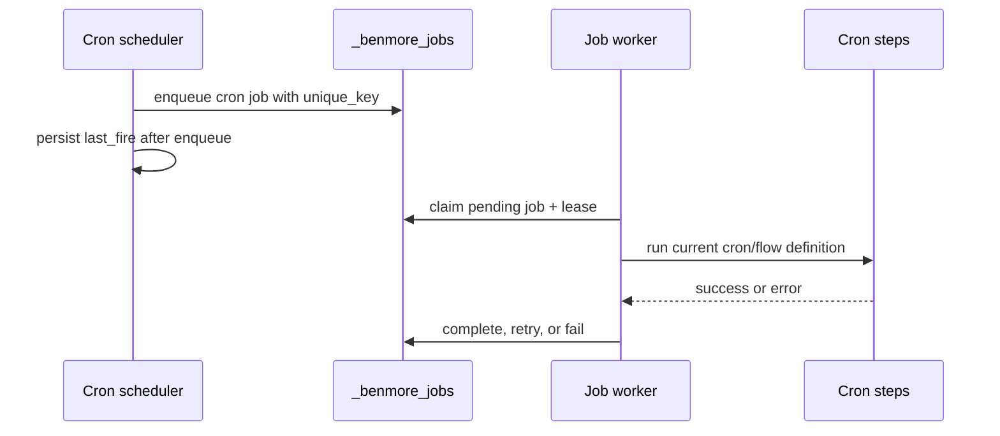

# Durable Jobs Frontier

Benmore has a lightweight durable queue in `_benmore_jobs`: delayed run times,
attempts, retries, worker claiming, leases, idempotency keys, cron execution,
and a status endpoint. These River-like slices keep the embedded queue simple
while making production retries and crash recovery predictable.



This does not import River. It keeps the existing embedded queue and makes the
transaction boundary, worker leases, uniqueness, and cron durability reliable
before adding larger queue primitives.

## Leases

When a worker claims a job it sets `lease_expires_at`. If the process crashes
before marking the job completed/failed, the next worker pass recovers expired
`running` jobs:

- `attempts < max_attempts` -> back to `pending`
- `attempts >= max_attempts` -> `failed`

This prevents jobs from staying in `running` forever after a crash.

## Unique Keys

`unique_key` is an optional idempotency key for active work. If a `pending` or
`running` job already has the same key, enqueue returns that existing job id and
status token instead of inserting another row. Once the earlier job completes or
fails, the same key can enqueue fresh work again.

Flow enqueue steps can set it with:

```yaml
- id: report
  enqueue:
    flow: generate_report
    unique_key: "report:${{ user_id }}:${{ params.month }}"
```

## Cron Jobs

Cron no longer launches best-effort goroutines. Each due schedule enqueues a
`job_type = 'cron'` row with a stable per-minute `unique_key`, then the normal
job worker executes it. That gives scheduled work the same lease recovery,
retry, status, and idempotency behavior as async flows.


