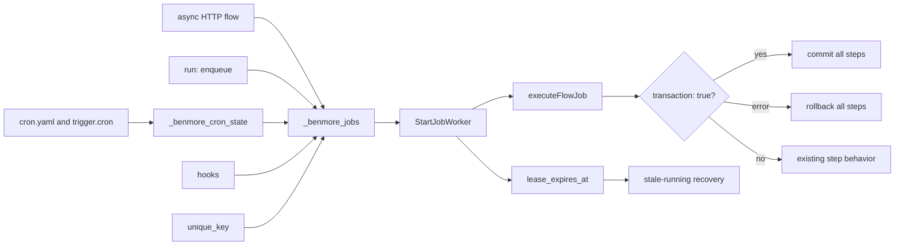
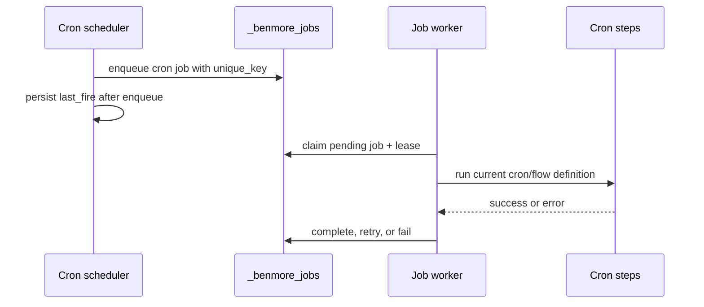

# Durable Jobs Frontier

Benmore has a lightweight durable queue in `_benmore_jobs`: delayed run times,
attempts, retries, worker claiming, leases, idempotency keys, cron execution,
and a status endpoint. These River-like slices keep the embedded queue simple
while making production retries and crash recovery predictable.



This does not import River. It keeps the existing embedded queue and makes the
transaction boundary, worker leases, uniqueness, and cron durability reliable
before adding larger queue primitives.

## Leases

When a worker claims a job it sets `lease_expires_at`. If the process crashes
before marking the job completed/failed, the next worker pass recovers expired
`running` jobs:

- `attempts < max_attempts` -> back to `pending`
- `attempts >= max_attempts` -> `failed`

This prevents jobs from staying in `running` forever after a crash.

## Unique Keys

`unique_key` is an optional idempotency key for active work. If a `pending` or
`running` job already has the same key, enqueue returns that existing job id and
status token instead of inserting another row. Once the earlier job completes or
fails, the same key can enqueue fresh work again.

Flow enqueue steps can set it with:

```yaml
- id: report
  enqueue:
    flow: generate_report
    unique_key: "report:${{ user_id }}:${{ params.month }}"
```

## Cron Jobs

Cron no longer launches best-effort goroutines. Each due schedule enqueues a
`job_type = 'cron'` row with a stable per-minute `unique_key`, then the normal
job worker executes it. That gives scheduled work the same lease recovery,
retry, status, and idempotency behavior as async flows.

### Retry semantics: at-most-once by default

Routing cron through the worker means a cron step CAN be retried. To avoid a
silent behavior change for non-idempotent schedules (carrier syncs, outbound
email, billing), each cron defaults to `max_attempts: 1` - **at-most-once**, the
same as the pre-durable-queue goroutine that ran a fire exactly once and never
retried it. A cron opts into **at-least-once** retries explicitly:

```yaml
idempotent_sync:
  schedule: "every 15m"
  max_attempts: 3        # opt in: failing steps retry with backoff
  flow: sync_all
```

Caveat for retried crons: `runCronJob` aborts on the first failing step, so a
retry re-runs steps 1..N from the top. Only set `max_attempts > 1` when the
whole step list is safe to re-run.

### Same-minute duplicate-fire guard

The cron `unique_key` is minute-specific (`cron:<id>:<minute>`). Unlike a
flow's `unique_key` (which can be reused once its job leaves pending/running),
the cron key is deduped against rows in **any** status - including `completed`.
That closes the window where a restart inside the same minute, after the first
job already finished and `last_fire` was lost, would otherwise re-enqueue and
fire the schedule a second time. `last_fire` (hydrated from
`_benmore_cron_state` at startup) is the primary guard; a hydration failure is
logged loudly and the any-status `unique_key` dedup is the backstop.

### Missing definitions

A cron row can outlive its definition (the schedule was edited/removed after the
row was enqueued). The worker treats "cron definition not found" as a terminal
no-op: it logs and completes the job rather than retrying and producing a
spurious `failed` row for work that no longer exists.


