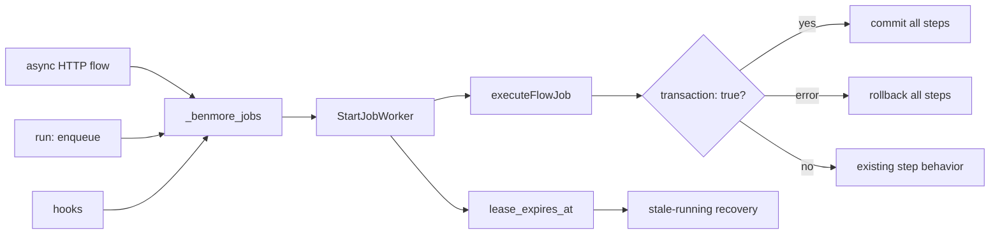

# Durable Jobs Frontier

Benmore already has a lightweight durable queue in `_benmore_jobs`: delayed
run times, attempts, retries, worker claiming, and a status endpoint. The first
River-like hardening slice is transaction correctness: jobs created inside a
transactional flow should commit or roll back with that flow, and worker-run
flows should honor their own `transaction: true` flag.

This does not import River. It keeps the existing embedded queue and makes the
transaction boundary and worker leases reliable before adding uniqueness or
cron-to-jobs conversion.

## Leases

When a worker claims a job it stamps `lease_expires_at` (now + lease window)
and a random `lease_owner` token. If the process crashes before marking the job
completed/failed, the next worker pass recovers expired `running` jobs.

Recovery is **fail-closed** to avoid duplicate side effects (C-1): a crashed
job's body ran *outside* the claim transaction, so we cannot know whether its
email / webhook / SQL side effects already fired before the crash. Re-running
blindly would risk delivering them twice.

- Job types on the `jobRerunSafeTypes` allowlist (proven idempotent; **empty by
  default**) -> back to `pending`, with the same exponential backoff as a normal
  failure (`1<<attempts * 30s`) so a job that reliably kills its worker does not
  hot-loop on immediate re-pickup.
- Every other orphaned `running` job -> `failed`, with an explanatory error, and
  is **never re-run** (re-running a non-idempotent job risks a duplicate
  email/webhook/mutation). An operator can inspect the failed row and re-trigger
  deliberately if it is safe.

Either way the job is reclaimed out of `running`, so it never sticks there
forever after a crash. A type graduates onto `jobRerunSafeTypes` only once its
handler is guarded by a per-job completion marker that makes a second run a
no-op.

### Lease renewal (the load-bearing invariant)

The lease window is **not** a maximum job runtime. While a worker is alive and
running a job it heartbeats the lease forward every lease-window/3
(`startLeaseHeartbeat` / `jobLeaseHeartbeatFor`), scoped to its `lease_owner`
token. A job may therefore
legitimately run far longer than one lease window without ever becoming
reclaimable.

The invariant the whole scheme rests on is: **an expired lease means the owning
worker is gone, not merely that the job is slow.** This is what makes recovery
safe under the queue's transient multi-worker overlap (across a SIGHUP reload):
a sweep can only reclaim a lease whose owner stopped heartbeating, so a
slow-but-alive worker's in-flight job is never reset to `pending` and
double-executed. Terminal writes (complete/fail/retry) are likewise guarded by
`lease_owner = ?`, so a worker whose lease lapsed and was reclaimed cannot stomp
the new owner's run.

The heartbeat interval must stay comfortably below the lease window so a brief
stall (GC pause, slow DB write) does not let the lease lapse while the worker is
still alive.

### Tuning

The lease window defaults to 5 minutes (`jobLeaseDuration`) and is overridable
per deployment via the `BENMORE_JOB_LEASE_SECONDS` env var (`jobLeaseDurationFor`).
It is the main knob for crash-recovery latency: shorter recovers faster but
heartbeats more often; longer is gentler on the DB but delays recovery of a
genuinely dead worker's jobs.

### Migration of pre-lease `running` jobs

Recovery only touches rows with a non-NULL `lease_expires_at`, so jobs left
`running` by pre-lease code would otherwise be stuck forever. `EnsureJobsTable`
runs a one-time best-effort backfill that stamps such rows with a lease anchored
at their `started_at`, letting the normal sweep recover them after the upgrade.

## Known limitation: side-effect idempotency

The `transaction: true` boundary only covers SQL executed through `flowDB`
(the active `*sql.Tx`). External side effects performed by other step
types — email, webhook, notify — are NOT transactional: a rollback cannot
undo them. When a transactional job fails *after* such a step, the whole
flow is rolled back and the job is later retried from the top, so the DB
writes are correctly reverted but the external side effects re-fire on the
retry. Until idempotency/unique keys land (see future work below), author
transactional flows so that side-effect steps are either idempotent or
ordered after the steps that can fail.

Future work: leases, uniqueness/idempotency keys, stale-running recovery,
cron-to-jobs conversion, and side-effect idempotency.

