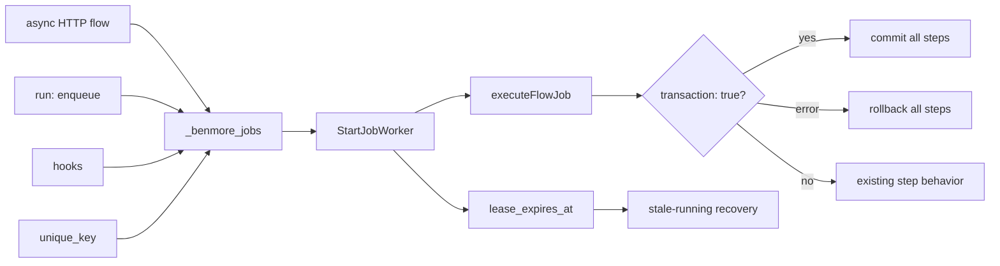

# Durable Jobs Frontier

Benmore already has a lightweight durable queue in `_benmore_jobs`: delayed
run times, attempts, retries, worker claiming, and a status endpoint. The first
River-like hardening slice is transaction correctness: jobs created inside a
transactional flow should commit or roll back with that flow, and worker-run
flows should honor their own `transaction: true` flag.



This does not import River. It keeps the existing embedded queue and makes the
transaction boundary and worker leases reliable before adding uniqueness or
cron-to-jobs conversion.

## Leases

When a worker claims a job it sets `lease_expires_at`. If the process crashes
before marking the job completed/failed, the next worker pass recovers expired
`running` jobs:

- `attempts < max_attempts` -> back to `pending`
- `attempts >= max_attempts` -> `failed`

This prevents jobs from staying in `running` forever after a crash.

## Unique Keys

`unique_key` is an optional idempotency key for active work. If a `pending` or
`running` job already has the same key, enqueue returns that existing job id and
status token instead of inserting another row. Once the earlier job completes or
fails, the same key can enqueue fresh work again.

**First active enqueue wins.** When an active job already holds the key, the
later enqueue is a no-op against the in-flight job: its `run_at` and `payload`
are *ignored* and not reconciled. A re-enqueue with an earlier `run_at` (e.g.
"run now" after an earlier "run in 1h") does **not** reschedule the in-flight
job - the original schedule stands. If you need a different schedule or payload,
wait for the in-flight job to finish (which releases the key) before
re-enqueuing.

**Transactional enqueue (`EnqueueJobTx`/`EnqueueJobTxUnique`).** Inside a
`*sql.Tx`, go-sqlite3 reads from the transaction's snapshot, so a row committed
by a *competing* transaction after the snapshot is invisible to the in-Tx dedup
SELECT. If two transactions race the same key, the loser's INSERT trips the
partial UNIQUE index; rather than failing the whole flow transaction, the loser
treats the collision as a successful idempotent no-op (returns id `0` / empty
token because the winner's id is unreadable from the stale snapshot). Tx callers
that need the winning job's id or status token should re-read by `unique_key`
after the transaction commits.

Flow enqueue steps can set it with:

```yaml
- id: report
  enqueue:
    flow: generate_report
    unique_key: "report:${{ user_id }}:${{ params.month }}"
```
