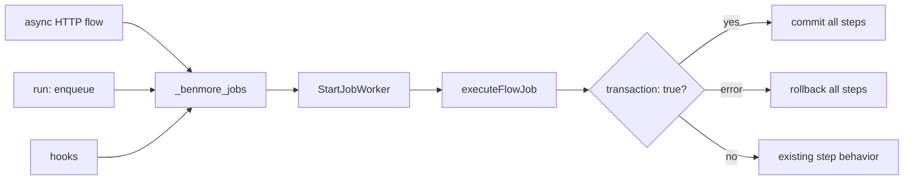

# Durable Jobs Frontier

Benmore already has a lightweight durable queue in `_benmore_jobs`: delayed
run times, attempts, retries, worker claiming, and a status endpoint. The first
River-like hardening slice is transaction correctness: jobs created inside a
transactional flow should commit or roll back with that flow, and worker-run
flows should honor their own `transaction: true` flag.

This does not import River. It keeps the existing embedded queue and makes the
transaction boundary reliable before adding leases, uniqueness, stale-running
recovery, or cron-to-jobs conversion.

