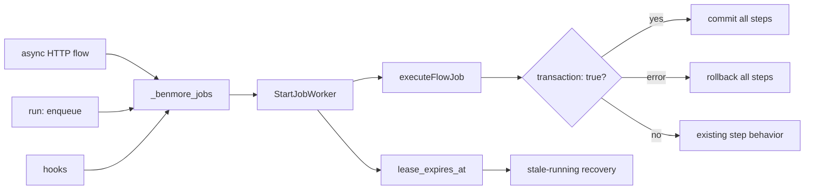

# Durable Jobs Frontier

Benmore already has a lightweight durable queue in `_benmore_jobs`: delayed
run times, attempts, retries, worker claiming, and a status endpoint. The first
River-like hardening slice is transaction correctness: jobs created inside a
transactional flow should commit or roll back with that flow, and worker-run
flows should honor their own `transaction: true` flag.

This does not import River. It keeps the existing embedded queue and makes the
transaction boundary and worker leases reliable before adding uniqueness or
cron-to-jobs conversion.

## Leases

When a worker claims a job it sets `lease_expires_at`. If the process crashes
before marking the job completed/failed, the next worker pass recovers expired
`running` jobs:

- `attempts < max_attempts` -> back to `pending`
- `attempts >= max_attempts` -> `failed`

This prevents jobs from staying in `running` forever after a crash.
