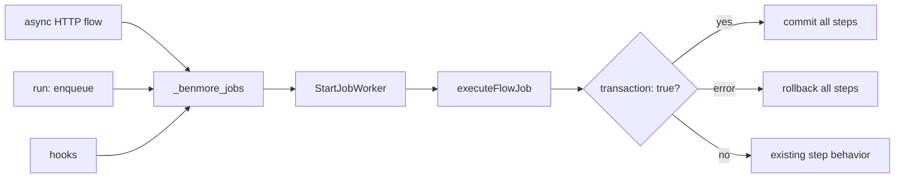

# Durable Jobs Frontier

Benmore already has a lightweight durable queue in `_benmore_jobs`: delayed
run times, attempts, retries, worker claiming, and a status endpoint. The first
River-like hardening slice is transaction correctness: jobs created inside a
transactional flow should commit or roll back with that flow, and worker-run
flows should honor their own `transaction: true` flag.

This does not import River. It keeps the existing embedded queue and makes the
transaction boundary reliable before adding leases, uniqueness, stale-running
recovery, or cron-to-jobs conversion.

## Known limitation: side-effect idempotency

The `transaction: true` boundary only covers SQL executed through `flowDB`
(the active `*sql.Tx`). External side effects performed by other step
types — email, webhook, notify — are NOT transactional: a rollback cannot
undo them. When a transactional job fails *after* such a step, the whole
flow is rolled back and the job is later retried from the top, so the DB
writes are correctly reverted but the external side effects re-fire on the
retry. Until idempotency/unique keys land (see future work below), author
transactional flows so that side-effect steps are either idempotent or
ordered after the steps that can fail.

Future work: leases, uniqueness/idempotency keys, stale-running recovery,
cron-to-jobs conversion, and side-effect idempotency.

