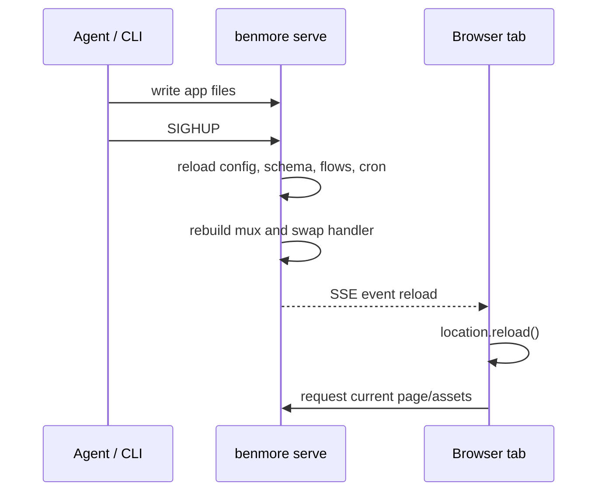

# Hot Reload Contract

Benmore dev/testing pages include a tiny browser client that listens to
`/sse/events` for framework-level `reload` events. A successful SIGHUP app swap
rebuilds the mux, keeps the listener socket open, then broadcasts `reload` so
open browser tabs refresh onto the new app config, routes, flows, cron, and
compiled static assets.

Production pages do not get the reload client by default. Authenticated apps
keep the existing `/sse/events` session gate unless they are running in local
`DevMode` or explicitly enable anonymous realtime transport with
`features.ws_anonymous`.

