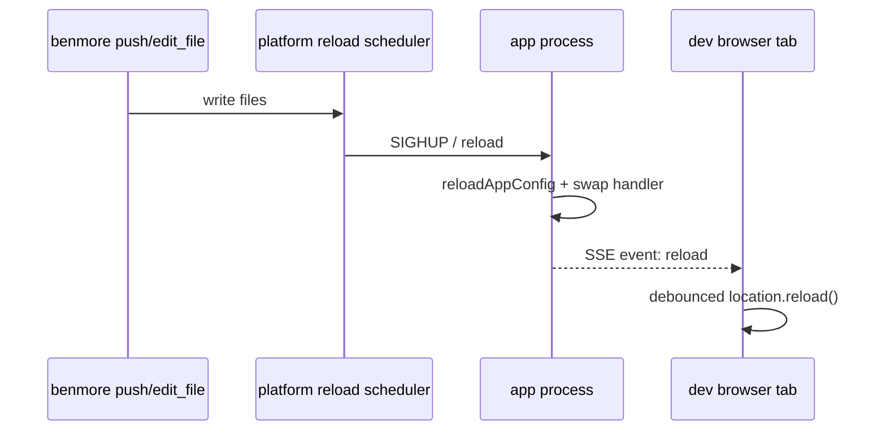
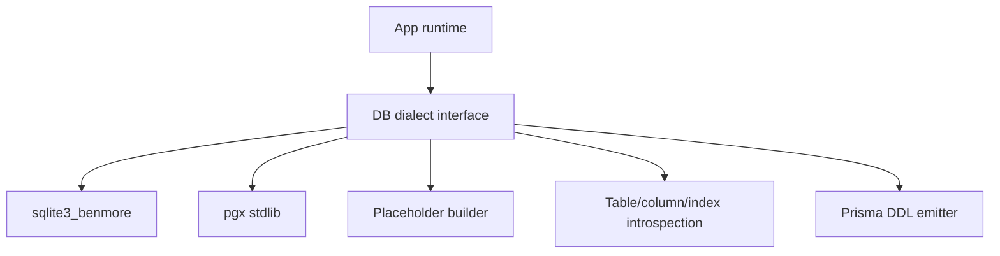
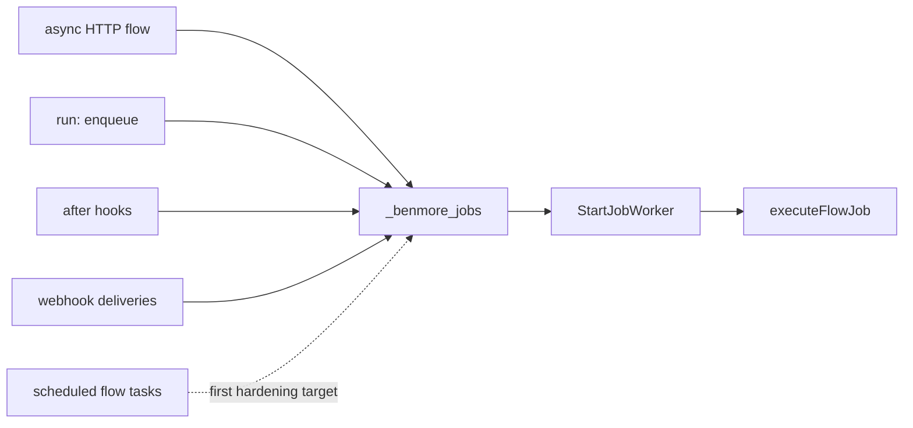

# Runtime Frontiers

This note keeps four production-readiness tracks separate. Each track has an
existing foundation in the codebase; first PRs should harden that foundation
before importing large external frameworks.

## Runtime Contracts

`/api/_docs` is the legacy Benmore docs shape. `/api/_openapi` is the OpenAPI
3.1 contract surface for app runtime APIs. `/api/_schema` remains the per-user
schema-driven UI descriptor and should not be renamed to OpenAPI.

```mermaid
flowchart LR
  Tables[App.Tables + Columns] --> OpenAPI[GET /api/_openapi]
  Tables --> BMTypes[/_internal/bm.d.ts]
  Tables --> Schema[GET /api/_schema]
  Schema --> SDUI[sdui components]
  OpenAPI --> Clients[client generators / contract checks]
  BMTypes --> Agents[TypeScript agent autocomplete]
```

First slice: generate OpenAPI 3.1 for core auto-CRUD only, with stable
operationIds, component schemas, security schemes, common error responses, and
`Cache-Control: no-store`.

## Hot Reload

The server already supports SIGHUP reload and handler swapping. The missing
browser-facing slice is a reliable dev reload event that reaches pages even
when they do not mount `[data-live]` components.



First slice: call `BroadcastReload("files-changed")` after successful debounced
reloads, add a tiny dev-only reload listener, and test that production pages do
not receive the listener.

## Postgres / pgx

SQLite is the default and remains the only fully-supported engine today.
Postgres support needs a dialect layer first; a global string rewrite from `?`
to `$n` is not safe.



First slice: add a small dialect abstraction and select pgx only for
`postgres://` / `postgresql://` DSNs. Keep unsupported SQLite-only features
explicitly rejected in Postgres mode until they have real equivalents.

## Durable Jobs

The current `_benmore_jobs` table is already a lightweight River-like queue:
delayed run time, attempts, retries, status API, and guarded claim update. The
immediate risk is inconsistent producers, not lack of a queue.



First slice: normalize enqueue helpers, make worker flow execution honor
`transaction: true`, and enqueue scheduled flow tasks instead of executing them
inline. Leave cron and workflow timeouts for later because their failure
semantics are user-visible.

