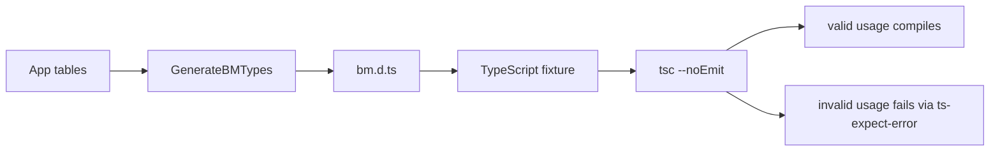

# Type Contract Checks

Benmore generates `bm.d.ts` from the app schema so agents get table names,
column types, flow signatures, and SDK methods in their editor. A compile
fixture is the fastest way to catch drift: valid SDK usage must compile, while
wrong table names and wrong field shapes must fail.

<!-- This flow mirrors the diagram in PR #7's description. If the flow changes,
keep the node names below and in the PR body in sync. -->

The fixture intentionally uses both valid calls and `@ts-expect-error` cases.
If a wrong table name or wrong field type stops failing, TypeScript reports the
expectation as unused and the Go test fails.

