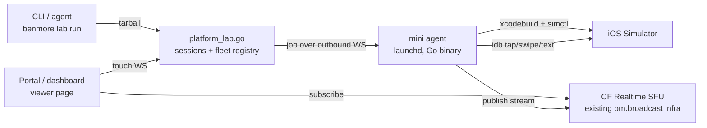

# Device Lab + Native SDKs (BYO Mobile Frontend)

Two tracks that together give Benmore a "bring your own mobile frontend"
story: write Swift/Kotlin/RN against a generated typed bm SDK, build it on
our Mac mini farm, and watch it run — streamed live — right on the
platform. Track 1 (SDKs) is core framework codegen. Track 2 (device lab)
is a satellite worker fleet behind a platform broker, following the same
trust model as the email/SMS brokers: workers hold no platform
credentials, the router owns the contract.

Status: design. Hardware on hand: 5 idle Apple Silicon Mac minis (office
LAN, residential IP — outbound-only connectivity is a hard requirement).



---

## Track 1 — Generated native SDKs (`bm.swift`, `bm.kt`)

### Why this is cheap

`bm_types.go` already generates a per-app typed SDK (`src/bm.d.ts`) from
schema.prisma + app.yaml + flows.yaml, auto-regenerated on every push.
Native SDKs are the same generator with two more template backends. The
backend surface is already clean REST + Bearer + SSE/WS — nothing about
it is JS-specific.

### Shape

- **`sdk_swift.go` / `sdk_kotlin.go`** (untagged, framework edition —
  same seam as `bm_types.go`). Each emits ONE self-contained file:
  - Swift: `BmClient.swift` — `Codable` structs per model, async/await
    URLSession client, Keychain-backed Bearer token store, typed CRUD
    (`bm.contacts.list/create/update/delete`), typed flow calls, uploads,
    SSE via `URLSession.bytes`, WS via `URLSessionWebSocketTask`.
  - Kotlin: `BmClient.kt` — `@Serializable` data classes,
    OkHttp + kotlinx.serialization, coroutines + `Flow` for SSE/WS,
    EncryptedSharedPreferences token store.
- Split each file into a **static runtime section** (hand-written once:
  auth, transport, SSE parsing, retry) and a **generated section**
  (models + typed surface). The generator only regenerates the second
  part; the runtime is embedded like `embedded/bm.js`.
- **Delivery**:
  - `benmore sdk swift|kotlin [--app X] [-o dir]` (CLI, `cloud || platform`).
  - `GET /api/_sdk/swift|kotlin` on the app (session/Bearer auth'd) so
    Xcode build phases / Gradle tasks can curl the latest.
  - MCP tool `generate_sdk` for agents.
- **Drift**: version-stamp the generated section with the schema hash;
  `benmore doctor` warns when the app's schema hash no longer matches
  the SDK the client last downloaded (report via a `X-Bm-Sdk-Version`
  header the generated client sends).
- **Type-contract fixtures** (same pattern as `type-contracts.md`): a
  `swiftc -typecheck` / `kotlinc` fixture in CI that compiles valid
  usage and asserts invalid usage fails. Run on the minis (they're the
  CI machines that have the toolchains).

### Non-goals

No UI components, no rendering, no opinions past the network layer. The
SDK is the contract; the frontend stack stays the user's problem — that
is the whole point of BYO.

---

## Track 2 — Device lab

### Components

**1. Mini agent** — a small Go binary (`benmore-lab-agent`, its own
`cmd/` or build tag; NOT part of the cloud CLI), run via launchd
`KeepAlive`. Responsibilities:

- **Register + heartbeat**: single OUTBOUND WebSocket to the broker
  (over Tailscale or plain HTTPS to the platform — the minis sit on a
  residential IP; nothing dials in). Auth: per-mini token minted by the
  operator (`benmore lab minis add`). Reports capabilities: Xcode
  version, available runtimes, booted sims, load.
- **Job execution**: receive job → download source tarball (signed URL)
  → `xcodebuild -scheme X -destination 'platform=iOS Simulator,...'
  -derivedDataPath /builds/<project>/dd build` → `simctl boot/install/
  launch` → stream build log lines back over the WS.
- **Stream publish**: v1 pragmatic — the agent drives a headless Chrome
  running a local capture page that `getDisplayMedia`-captures the
  simulator window and publishes through the EXISTING Cloudflare
  Realtime SFU path (`bm.broadcast.publish` semantics; the platform
  already holds `BENMORE_PLATFORM_SFU_CF_APP_ID/TOKEN` and proxies SDP —
  broadcast.go). v2 native: ScreenCaptureKit → H.264 → pion, delete the
  Chrome hack.
- **Input relay**: subscribe to the session's input channel; map
  normalized viewer coords (0..1) to device points; drive
  `idb ui tap|swipe|text`. idb is the flaky joint — pin versions, wrap
  every call with health-check + companion restart.
- **Hygiene**: shutdown sims + wipe `/builds/<project>/src` on session
  end (keep `dd/` DerivedData cache), nightly GC, `caffeinate` /
  power-assertion while a session is live.

**2. Broker** — platform-side (`platform_lab.go`, `platform` tag),
following the fleet-service pattern:

- **Tables** (platform.db):
  - `lab_minis(id, name, token_hash, xcode_version, last_seen_at,
    status, capacity, sticky_key)`
  - `lab_sessions(id, user_id, app_id NULL, project_key, mini_id,
    status queued|building|streaming|ended|failed, scheme, device,
    stream_slug, viewer_token_hash, build_log_path, created_at,
    started_at, ended_at, idle_deadline)`
- **Endpoints** (`/api/v1/lab/*`):
  - `POST /sessions` — multipart tarball (size-capped, ~200MB) or
    `{git_url, ref}`; returns `{session_id, status_url}`. Assignment is
    STICKY: hash(project_key) → preferred mini so DerivedData caches
    stay warm (first build minutes, warm rebuilds seconds).
  - `GET /sessions/{id}` — status + stream URL when live;
    `GET /sessions/{id}/log` — build log (SSE tail).
  - `POST /sessions/{id}/input` |
    `WS /lab/input/{id}` — viewer↔agent touch/key relay (router-side
    room, same plumbing as app WS but platform-scoped).
  - `GET /sessions/{id}/screenshot` — agent-verification loop: returns
    PNG straight from `simctl io screenshot`.
  - `DELETE /sessions/{id}` — teardown. Plus idle timeout (no viewer +
    no input for N min → end).
  - `WS /lab/agent` — the mini fleet channel (token auth).
- **Viewer auth**: platform users see their own sessions. For CLIENTS
  (portal end-users without platform accounts): short-lived HMAC-signed
  viewer URLs (same recipe as signed_urls.go) — `lab.benmore.ai/s/<slug>?
  sig=…&exp=…` — so a preview link can be dropped into a portal chat.

**3. Viewer page** — one page, two embeddings:

- `apps/_platform` dashboard: "Device Lab" tab per app — session list,
  New Preview, the live stream inside device chrome (frame, notch,
  correct aspect), tap/scroll/type forwarding, build-log drawer.
  (Platform pages ship via repo + rsync, per the _platform rules — NOT
  as MCP tenant-app edits.)
- Standalone `lab.benmore.ai/s/<slug>` (or `/lab/<slug>` on the root
  domain): the same viewer, iframe-safe, driven by the signed viewer
  token — this is what gets embedded in the service portal and pasted
  to clients.

**4. CLI + MCP** (`cli_lab.go`, `cloud || platform`; `mcp_tools_lab.go`):

```
benmore lab run [dir] [--app X] [--scheme S] [--device "iPhone 16"]
    # tar working tree (respect .gitignore) → POST → poll → print
    # build log tail, then:  ▶ https://lab.benmore.ai/s/k3j9x2  [QR]
benmore lab ls | logs <id> | shot <id> [-o f.png] | stop <id>
benmore lab minis [add|rm|status]         # operator fleet management
```

MCP mirrors: `lab_run`, `lab_status`, `lab_screenshot` (returns the
image — agents can SEE the running app), `lab_tap`, `lab_stop`. That
closes the agent loop for native code: edit Swift → `lab_run` → read
compile errors → `lab_screenshot` → verify → iterate. It is the native
equivalent of `browser_check`.

### Security posture (v1 = internal trust, explicit)

- `xcodebuild` executes arbitrary build scripts → **v1 is
  operator/staff-only** (gate `POST /sessions` on the operator email
  list or a `lab` role). Do NOT expose to arbitrary platform users.
- The path to opening it up later: ephemeral macOS VMs per build via
  tart (Apple's 2-VM-per-host licensing cap → 5 minis = 10 concurrent
  isolated builds). That is the "resell this as a platform feature"
  gate, not a v1 concern.
- Minis: outbound-only (Tailscale/HTTPS), per-mini token, separate
  office VLAN if available, Screen Sharing kept on as the operator
  backdoor, auto-login + sleep disabled, macOS/Xcode updates pinned and
  rolled one canary mini first.
- Source tarballs + build logs: retained per session, wiped on GC;
  never leave the mini except the log stream to the broker.

### Capacity

5 × Apple Silicon minis ≈ 1–2 smooth concurrent streams each (5–10
fleet-wide), far above internal demo/dev needs. Sticky assignment keeps
per-project caches hot; overflow queues (status `queued`, CLI shows
position). Same fleet doubles as: Fastlane TestFlight/App Store upload
runners, Android emulator hosts (M-series runs arm64 AVDs natively; same
capture path), and SDK type-contract CI (Track 1).

### Milestones

- **M0 (½ day)**: provision script for mini #1 (Tailscale, Xcode CLT,
  idb, launchd skeleton, /builds layout) + a local `devicelab` Claude
  Code skill (rsync + ssh xcodebuild + simctl + screenshot) — agent-driven
  native builds work before ANY platform code exists. ALSO evaluate the
  now-existing OSS self-hosted streamers before writing our own capture
  layer: `jo-duchan/tapflow` (TS, ~128★, active Jul 2026) and
  `mobile-sim-streamer` (~151★, active) both claim interactive iOS-sim +
  Android-emulator streaming to the browser. If either holds up, our
  streaming layer becomes "wrap it behind the broker" and M2 shrinks;
  the broker/CLI/SDK/portal integration stays ours either way.
- **M1 (≈1 wk)**: agent binary + broker tables/endpoints + `benmore lab
  run/ls/logs/shot/stop` + MCP tools. No streaming yet — screenshots are
  enough for the dev loop.
- **M2 (≈1 wk)**: streaming (Chrome-capture → CF SFU), viewer page,
  dashboard tab, input relay, signed viewer links + QR.
- **M3**: portal embedding (service-client chat posts preview links),
  Android emulator support, all 5 minis enrolled.
- **M4** (parallel track, independent): `sdk_swift.go` + `sdk_kotlin.go`
  + `benmore sdk` + doctor drift check + compile fixtures on the minis.
- **Later**: native ScreenCaptureKit/pion publisher, tart isolation,
  plan-gated public availability, `api(at:"lab")` + `api(at:"sdk")`
  topics when user-facing.

### Open questions

- Stream transport for input: piggyback the existing router WS vs a
  dedicated `/lab/input` socket (leaning dedicated — platform-scoped,
  not app-scoped).
- Tarball vs git-ref as primary source delivery (leaning tarball first:
  matches the uncommitted inner loop; git-ref later for portal-triggered
  client previews).
- Whether `lab.benmore.ai` is a real subdomain or a root-domain route
  (`_platform` serves root; subdomain would need router carve-out like
  `edge-*`).
